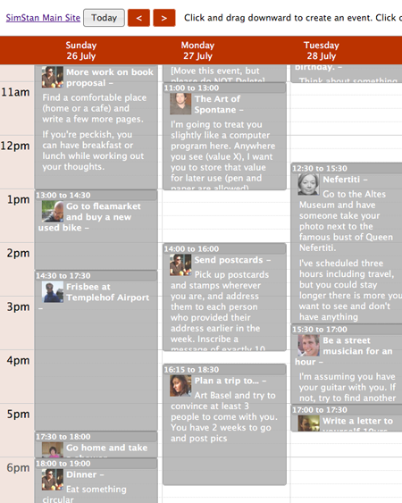

SimStan
=======

A project by Stan James.

Technical Details
-----------------
MySQL database is in file simstan.sql

Directory 'html' contains all files that should be put on your webserver. It is a basic Drupal 6 installation with several custom modules.

Search all files for the following values, which you need to replace with your own:

- SIMSTAN_DB_USERNAME 
- SIMSTAN_DB_PASSWORD
- SIMSTAN_DB_NAME
- YOUR_KEY_HERE
- your@email.address.com

You will need to reset the password of user 1 (admin).

This is a quick-n-dirty release. Any questions, contact me at stan@wanderingstan.com

For all it’s faults, Drupal is still a fast way to prototype. SimStan is based on a standard Drupal 6 installation. The wonderful FBconnect module gave me an instant and easy connection to Facebook. The Event Module added basic date information to nodes, and iCal export that I could load in my iPod touch. However, it’s interface is awful. The fantastic JQuery Week Calendar by Rob Monie has the look-n-feel of Google Calendar. Most of my work was modifying his code into a custom Drupal module which would modify Event nodes, while displaying things like Facebook avatars. Of course lots of theme integration to give everything the same style, and little things like Cron jobs to email me my schedule each day and make backups of the database.

Background Story
----------------

Full blog post: http://wanderingstan.com/2009-12-01/simstan-the-story-of-a-summer-project

This summer in Berlin I took a vacation from making choices, and let my friends run my life.

Really.

For one week, anyone who was my friend on Facebook could edit my calendar, and I ran my life according to that calendar. Inspired by the popularity of “The Sims” game series, a friend of mine dubbed the project SimStan.  In this post I want to give a little bit of the reasoning behind SimStan, tell what it was like to live that way for a week, and share my feelings of why the project “didn’t work.” (And for any nerds reading, at the end I’ll talk about how it was built and give you the code if you want to build a SimYou.)

Starting almost two years ago, I became obsessed with the idea that people had too many choices. This came to a head in reading Barry Schwartz’s excellent book The Paradox of Choice. You have more choices than ever these days, and this excess of freedom paradoxically leads to unhappiness as you regret all the things you might have done. One trick to avoid this is to use an agent. If anyone or anything makes the choice for you, and you trust the agent, then you’re spared all the research into alternate choices. It’s why I only go clothes shopping with my friend Steph in New York; she’s my clothing agent. The original idea was to write a program that would similarly tell you what to do, but it would need some initial data of things it could suggest. I hit upon the idea of letting friends feed “possible events” into the system. And soon thereafter realized that the friends would be enough–it would be like Wikipedia, except friends editing your life! Or, in the parlance of Web 2.0, a “crowdsourced calendar.”

With this enthusiasm, I finally set about building the software last July. It took about three weeks of sitting in Berlin Cafés to put it all together. It involved creating a dynamic calendar interface similar to Google Calendar, meshed with Facebook’s login system. It looked and worked great. (More on technical construction in the postscript.) The site is still up and running today. You can play with it at http://simstan.com. Click the “Connect with Facebook” button to log in as a Facebook user. Last summer you had to be my friend to edit anything, but for now I’ve changed it so anyone can play around.

I emailed about 40 friends who had expressed interest in the project, and pretty soon my designated week began to fill up. It was an interesting week! I visited a lot of museums, did some writing for a book project, did a scavenger-hunt through my neighborhood, wrote a letter to myself 10 years hence, and watched a Spanish space-themed wordless comedy show. You can read the exact details on the project blog, (First day, 2nd and 3rd days, and remaining day) but I won’t rehash it all here.

SimStan wasn’t “successful” in the sense that I’d hoped—more like an experiment where the scientists hypothesis is not confirmed! In a not-so-scientific off-the-cuff way, here were the problems I found.

> Turns out that running a life involves much more minutia than I expected, and this is compounded by people not planning for all the minutia that goes into even simple life planning. If I’m going to a show, I’ll need to buy tickets. If I’m going to buy tickets, I’ll need some time in front of a computer and internet in order to buy those tickets. And sometimes, like when you’re in a foreign country, you’ll need a few hours to straighten things out with your bank to buy those tickets. For a friend casually putting something on a calendar, they can’t be expected to think of all these contingencies.
> Having just moved to Berlin, a lot of my state-side friends didn’t know what sorts of things to have me do.
> I had hoped that SimStan would work out like Wikipedia, where many people making small edits end up making something amazing. But it turns out there is a critical difference: A Wikipedia article doesn’t have a deadline, and can slowly accrue usefulness over years. A plan for next Tuesday, on the other hand, has a very real deadline! And is basically useless after Tuesday.
> On a related note, friends were conservative in time-grabbing. I suppose no one wanted to seem “greedy” or overly domineering, so people tended to schedule using best-case-scenarios of how long some event might take.
> Friends would not edit each others work. I had hoped that when there was something “wrong” in the schedule, that friends would step in, Wikipedia-like, to fix thing. But this didn’t happen, for example, when I was scheduled to both get up early for walks and to go out to clubs until 4am. Then one time when an event was moved, it just left the original event creator confused.
> Turns out that I, and I think most people, need a lot of “down time” during a day. To be following a schedule hour-by-hour means to be continually “on.”  I found myself monitoring my time in the same way you monitor your fare in a moving taxi. It’s stressful.
> All of the above meant that I was often running out of time. I realized after a few days that I was actually keeping two calendars, the official one on the website, and an internal one where I planned out all the prep-work and recovery time that I would need.

So when the project ended on that Tuesday, I was actually quite relieved. At the same time, a little embarrassed, since I had been telling people about my hopes for the project for so long. How could I now say that I was happy it was over? So I just dropped it and moved on to other projects. It wasn’t until I visited my friends Steph and Ken in New York a few weeks ago, and an email exchange with Neil Robertson, that they encouraged me to do this write-up.

I’m glad that I did it. It’s all too easy to let a project idea grow inside of you, and you become ever more convinced of how amazing it would be if only you built it. In that sense, I am “free” of SimStan. Perhaps I’ll revisit the idea someday with some fresh ideas. In any case, I learned a ton: technically from building the software, pragmatically about  events and scheduling and how a person actually plans out a day, and existentially about all the little parts that go into “making a day” that we usually take for granted.

